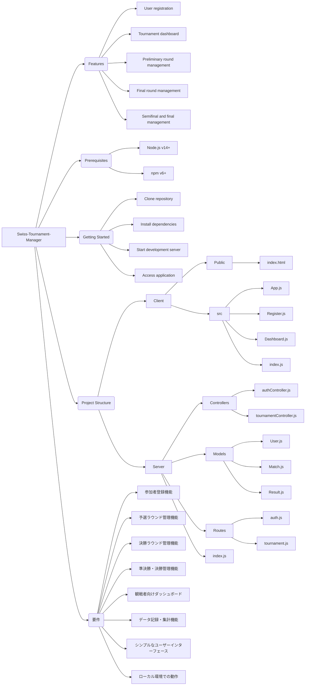

# Swiss-Tournament-Manager
Swiss-Tournament-Manager for JoinWars at VRChat

## Features

- User registration
- Tournament dashboard
- Preliminary round management
- Final round management
- Semifinal and final management

## Prerequisites

- Node.js (v14 or later)
- npm (v6 or later)

## Getting Started

1. Clone the repository:

```
git clone https://github.com/your-username/dominion-tournament.git
```

2. Install dependencies for both the frontend and backend:

```
cd dominion-tournament/client
npm install

cd ../server
npm install
```

3. Start the development server:

```
cd ../client
npm start

cd ../server
npm start
```

4. Open your browser and navigate to `http://localhost:3000` to access the application.

## Project Structure

- `client/`: Frontend React application
  - `public/`: Static files
    - `index.html`: Entry point for the application
  - `src/`: Application source code
    - `App.js`: Main App component
    - `Register.js`: User registration component
    - `Dashboard.js`: Tournament dashboard component
    - `index.js`: Entry point for the React application

- `server/`: Backend Express application
  - `controllers/`: Request handlers
    - `authController.js`: Authentication-related request handlers
    - `tournamentController.js`: Tournament-related request handlers
  - `models/`: Data models
    - `User.js`: User model
    - `Match.js`: Match model
    - `Result.js`: Result model
  - `routes/`: Routing
    - `auth.js`: Authentication-related routes
    - `tournament.js`: Tournament-related routes
  - `index.js`: Entry point for the Express application

---

要件

1. 参加者登録機能
   - 参加者が名前とIDを登録できる
   - 運営者が参加者リストを管理できる

2. 予選ラウンド管理機能
   - 4人対戦のマッチメイキング（3人対戦にも対応）
   - スイスドロー方式でのマッチング
   - 参加者が勝ち点と順位を報告できる
   - 4ラウンド終了後、勝ち点上位22名を決勝進出者として選出

3. 決勝ラウンド管理機能
   - 予選通過者とシード選手でマッチメイキング
   - 参加者が勝ち点と順位を報告できる
   - 5ラウンド終了後、勝ち点上位8名を準決勝進出者として選出

4. 準決勝・代表決定戦管理機能
   - 対戦カード選択プロセスの管理
   - 参加者が勝ち点と順位を報告できる

5. ビューワー向けダッシュボード
   - 予選・決勝ラウンドの進捗状況を表示
   - 参加者ランキングを表示
   - 次ラウンドのマッチメイク結果を表示

6. データ記録・集計機能
   - 各ラウンドの対戦結果を記録
   - 総合勝ち点と総合獲得点数を集計してランキングを作成

7. シンプルなユーザーインターフェース
   - 参加者用: 登録、結果報告
   - 運営者用: 参加者管理、マッチメイク実行、各ラウンドの進行管理
   - ビューワー用: ダッシュボード閲覧

8. ローカルホストでの動作
   - Nginxローカルホストで動作させる
  
---


